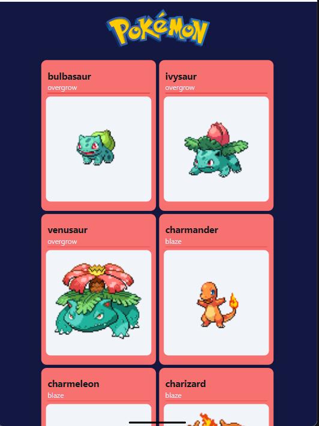
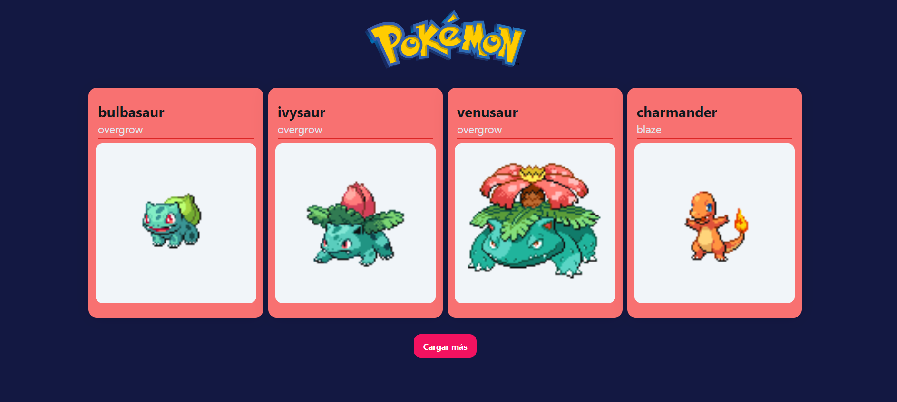

# PokeAPI con Redux Toolkit y React

Este proyecto es una aplicación React que obtiene y muestra datos de Pokémon desde la PokeAPI. La aplicación utiliza Redux Toolkit para la gestión del estado y Tailwind CSS para los estilos. Los usuarios pueden cargar más Pokémon en lotes de 4 al presionar un botón.

## Instalación

1. Clonar el repositorio:
   ```sh
   git clone https://github.com/CosmeNicolas/PokeRedux

2. Instalar dependencias:
    ```sh
   npm install 

3. Instalar dependencias:
    ```sh
   npm run dev 

### Imagenes del proyecto 

